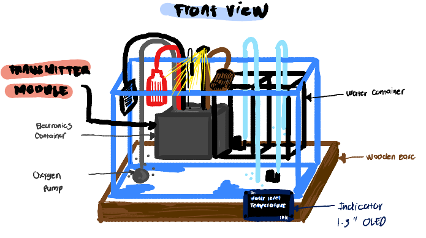
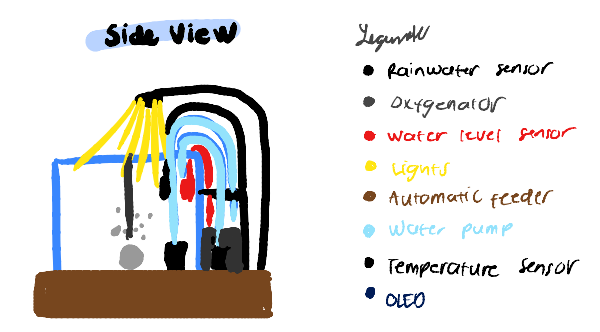
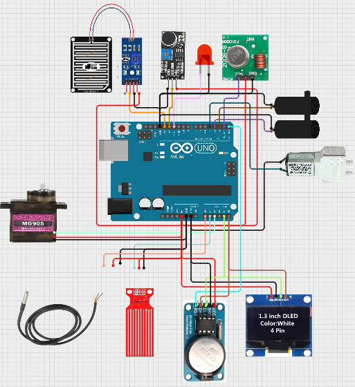

# Advanced-Telecommunications-Laboratory-Final-Project

This project presents an **Automated Aquarium System** developed to maintain optimal environmental conditions for aquatic life using embedded systems. The report demonstrates how sensors, actuators, and a microcontroller work together to monitor key parameters such as **temperature and water level**, while also automating essential functions like **fish feeding and alert notification**.

In this documentation, readers will see the **system design, hardware setup, circuit implementation, and actual outputs** of the project, including images of the prototype and a video demonstration of its operation.

The project highlights the practical application of **real-time monitoring, control logic, and automation**, making it a relevant example of how electronics engineering concepts can be applied to real-world systems.

# Automated Aquarium System

This project presents the design and implementation of an **Automated Aquarium System** that monitors and maintains optimal environmental conditions for aquatic life. The system integrates multiple sensors and actuators controlled by a microcontroller to automate **temperature monitoring, water level detection, feeding schedules, and alert notifications**.  

By combining real-time sensing and embedded control, the system reduces manual intervention and ensures a more stable and reliable aquatic environment, which is essential for the health and survival of fish and other organisms.

---

## Objective

- To design and implement an automated aquarium monitoring system.  
- To integrate multiple sensors and actuators using a microcontroller.  
- To apply real-time monitoring and control techniques.  
- To improve efficiency and reliability of aquarium maintenance.  

---

## Components and Their Functions

### 1. DS18B20 Temperature Sensor
The DS18B20 is a digital temperature sensor used to measure the water temperature inside the aquarium. It communicates using a **1-wire protocol**, which allows multiple sensors to be connected using a single data line.  

Its waterproof design makes it highly suitable for submerged applications. Maintaining the correct temperature is critical since fish are sensitive to sudden temperature changes.

---

### 2. Water Level Sensor
The water level sensor detects the amount of water inside the aquarium. It helps prevent conditions such as **low water level**, which may damage equipment or harm aquatic life.  

The sensor provides either analog or digital signals depending on its type, allowing the system to determine whether the water level is within a safe range.

---

### 3. MG90S Servo Motor (Feeding Mechanism)
The MG90S servo motor is used to automate the feeding process. It rotates to a specific angle to release food into the aquarium.  

The servo is controlled using **PWM (Pulse Width Modulation)** signals, allowing precise control of its position. This ensures consistent feeding portions and timing.

---

### 4. Active Alarm Buzzer Driver Module
The buzzer module provides **audible alerts** when abnormal conditions are detected, such as low water level or unsafe temperature.  

This feature adds a layer of safety by immediately notifying the user of any issues that require attention.

---

### 5. DS1307 Real-Time Clock (RTC)
The DS1307 RTC module keeps track of time even when the system is powered off, thanks to its backup battery.  

It is used to schedule feeding operations at specific times, ensuring that fish are fed consistently without manual intervention.

---

### 6. 0.96” SSD1306 OLED Display
The OLED display provides a user interface that shows real-time system data such as:
- Temperature  
- Water level status  
- Current time  

It uses **I2C communication**, which reduces wiring complexity and allows efficient data transfer.

---

## Procedure

### Step 1 – Hardware Setup

1. Connect the **DS18B20 temperature sensor** to the microcontroller with a pull-up resistor.  
2. Connect the **water level sensor** to an input pin.  
3. Connect the **servo motor (MG90S)** to a PWM-capable pin.  
4. Connect the **buzzer module** to a digital output pin.  
5. Connect the **DS1307 RTC module** via I2C (SDA and SCL).  
6. Connect the **OLED display (SSD1306)** via I2C.  

---

## System Setup Images

### Front View (Initial)

### Side View (Initial)

### Initial Circuit Diagram

### Final Front View

---

## Video Demonstration and Final Output

[Click here to view the demonstration and final product](https://drive.google.com/drive/folders/1qf0ZMtkF3iGkjAJ5satDrbZRme6qSVoh?usp=drive_link)

---

## System Operation

Once powered, the system continuously reads sensor data and updates the display. The temperature and water level are monitored in real time, while the RTC ensures that feeding occurs at predefined intervals.

The system performs the following operations:
- Displays real-time temperature, water level, and time  
- Activates buzzer when abnormal conditions occur  
- Rotates servo motor during scheduled feeding  

---

---

## Discussion

The Automated Aquarium System demonstrates the practical application of **embedded systems in environmental control**. By integrating sensors, actuators, and timing modules, the system creates a closed-loop monitoring setup that responds dynamically to changing conditions.

One key observation is the importance of **sensor accuracy and calibration**. The DS18B20 sensor provides stable and precise readings, which is critical because even small temperature fluctuations can affect aquatic life. Similarly, the water level sensor ensures that the system can detect unsafe conditions early, preventing potential damage.

The use of a **real-time clock (RTC)** introduces the concept of time-based automation, which is essential in many engineering systems. Feeding schedules are executed reliably regardless of system resets or power interruptions, demonstrating the importance of persistent timekeeping.

The **servo motor** highlights how mechanical systems can be integrated with digital control. Its precise angular movement allows consistent food dispensing, which improves feeding accuracy compared to manual methods.

The **buzzer module** plays a crucial role in safety by providing immediate feedback. This is particularly important in real-world systems where unattended operation is common.

Another important aspect is the **OLED display**, which enhances usability by providing real-time feedback. Without it, troubleshooting and monitoring would be significantly more difficult.

Overall, the system reflects how multiple subsystems—sensing, processing, and actuation—work together to form a reliable automation solution.

---

## Conclusion

The Automated Aquarium System successfully demonstrates the integration of sensors, actuators, and embedded control to create a self-regulating environment. The system is capable of monitoring temperature and water level, providing alerts, and automating feeding schedules.  

By reducing human intervention and increasing reliability, the system ensures better maintenance of aquarium conditions. This project highlights the effectiveness of embedded systems in solving real-world problems through automation and intelligent control.

---

## Learnings

- Developed skills in interfacing multiple hardware components with a microcontroller  
- Gained experience in using **digital sensors and communication protocols (I2C, 1-wire)**  
- Learned how to implement **real-time control systems using RTC modules**  
- Understood the importance of **feedback systems in automation**  
- Improved knowledge in integrating **hardware and software for system design**  
- Strengthened troubleshooting and debugging skills in embedded systems  

---

## Future Improvements

- Add wireless monitoring using WiFi or Bluetooth  
- Integrate mobile application control  
- Include additional sensors such as pH and turbidity  
- Implement data logging for long-term monitoring and analysis  

